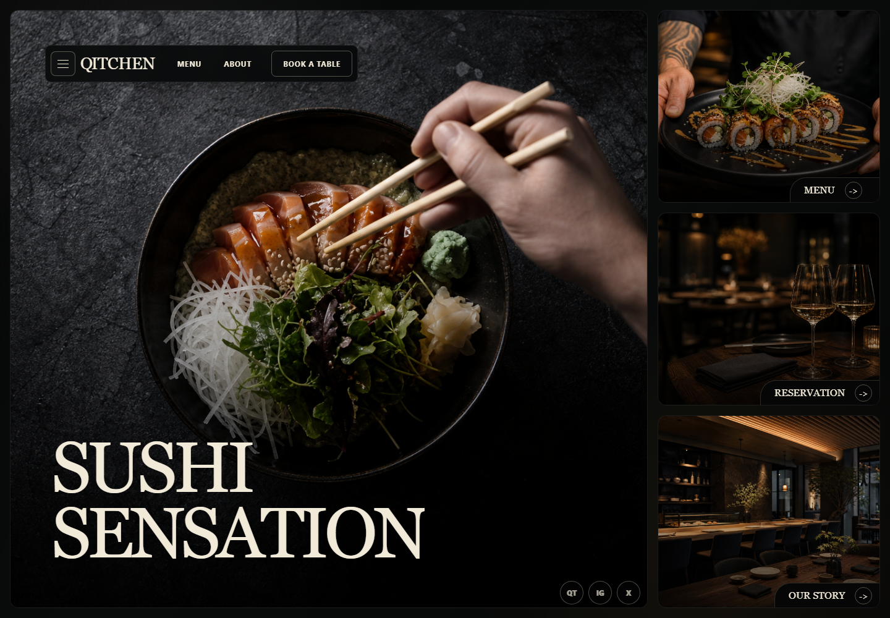

# Qitchen Animated Restaurant Website



Qitchen is a dark, cinematic sushi restaurant website inspired by a premium Framer template. It recreates the editorial restaurant experience with original generated food photography, responsive layouts, and a polished animation layer built with plain HTML, CSS, and JavaScript.

## Live Demo

If you are running this project locally, start a static server from the project root:

```bash
python -m http.server 4173 --directory outputs/qitchen-site
```

Then open:

```text
http://127.0.0.1:4173/
```

## Highlights

- Premium dark restaurant interface inspired by the Qitchen Framer design.
- Fully responsive home, menu, about, and reservation pages.
- Original generated sushi and restaurant photography.
- Large cinematic hero panels with editorial serif typography.
- Animated image reveals, headline reveals, staggered cards, and hover motion.
- Interactive mobile navigation.
- Reservation form with client-side validation and success feedback.
- No frontend framework required.

## Animation Details

The site includes a CSS-first motion system designed to feel smooth and high-end without adding animation libraries.

| Animation | Description |
| --- | --- |
| Page fade | The whole interface softly fades in on load. |
| Navigation reveal | The nav bar slides and scales into place. |
| Image settle | Hero images animate from slight blur and zoom into focus. |
| Panel veil | Image cards reveal with a dark cinematic wipe. |
| Title reveal | Large serif headings rise in with a clipped text reveal. |
| Card stagger | Home cards and about cards enter one by one. |
| Menu stagger | Menu items animate into view with subtle vertical motion. |
| Hover polish | Cards, buttons, pills, and thumbnails lift or zoom on interaction. |
| Reduced motion | `prefers-reduced-motion` is supported for accessibility. |

## Pages

| Page | Path | Description |
| --- | --- | --- |
| Home | `outputs/qitchen-site/index.html` | Hero image, navigation, social dock, and section cards. |
| Menu | `outputs/qitchen-site/menu/index.html` | Sushi categories, dish thumbnails, descriptions, and pricing. |
| About | `outputs/qitchen-site/about/index.html` | Brand story, awards, chef image, and editorial cards. |
| Reservation | `outputs/qitchen-site/reservation/index.html` | Booking form with animated input states and confirmation text. |

## Project Structure

```text
.
+-- README.md
+-- outputs/
    +-- qitchen-site/
        +-- index.html
        +-- styles.css
        +-- script.js
        +-- assets/
        |   +-- readme-preview.png
        |   +-- hero-sushi.png
        |   +-- rolls-plated.png
        |   +-- reservation-table.png
        |   +-- restaurant-interior.png
        |   +-- chef-prep.png
        |   +-- sushi-assortment.png
        +-- menu/
        |   +-- index.html
        +-- about/
        |   +-- index.html
        +-- reservation/
            +-- index.html
```

## Tech Stack

- HTML5
- CSS3
- Vanilla JavaScript
- CSS Grid
- CSS keyframe animations
- Responsive media queries

## Run Locally

Clone the repository and run:

```bash
python -m http.server 4173 --directory outputs/qitchen-site
```

Visit:

```text
http://127.0.0.1:4173/
```

No install step is required.

## Deploy

For static hosting services such as Netlify, Vercel, Cloudflare Pages, or GitHub Pages, use this folder as the publish directory:

```text
outputs/qitchen-site
```

For GitHub Pages specifically, you can also move the contents of `outputs/qitchen-site` to the repository root or to a `docs/` folder, then configure Pages to serve from that location.

## Customization

Global colors, type, and radius values are defined in `outputs/qitchen-site/styles.css`:

```css
:root {
  --bg: #050605;
  --cream: #f2ead9;
  --gold: #d7c59a;
  --radius: 14px;
}
```

The main animation keyframes are also in `styles.css`:

- `pageGlow`
- `veilOut`
- `imageSettle`
- `riseIn`
- `titleIn`
- `navIn`
- `lineIn`

## Notes

This is a static front-end project. The reservation form displays an in-page success message and does not submit data to a backend.
